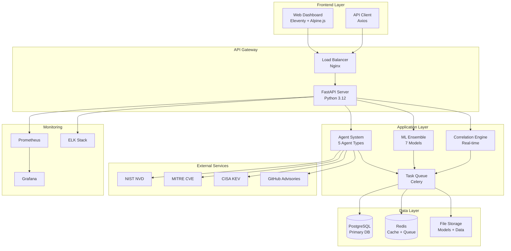

# NOPE System Architecture

## Overview

NOPE (Network Operations Predictive Engine) is a comprehensive CVE intelligence platform that leverages machine learning and agent-based architecture to predict, analyze, and correlate cybersecurity vulnerabilities in real-time.

## High-Level Architecture



## System Components

### 1. Frontend Layer

#### Web Dashboard (Eleventy)
- **Technology**: Eleventy static site generator with Alpine.js
- **Purpose**: Interactive dashboard for CVE visualization and analysis
- **Features**:
  - Real-time CVE monitoring dashboard
  - Predictive analytics visualization
  - Threat correlation reports
  - Administrative interface
  - Responsive design for mobile/desktop

#### API Client
- **Technology**: Axios for HTTP requests
- **Purpose**: Frontend-backend communication
- **Features**:
  - RESTful API consumption
  - Real-time WebSocket connections
  - Authentication handling
  - Error handling and retry logic

### 2. API Gateway

#### Load Balancer (Nginx)
- **Purpose**: Request routing and SSL termination
- **Features**:
  - HTTPS termination
  - Rate limiting
  - Request routing
  - Static file serving
  - Gzip compression

#### FastAPI Server
- **Technology**: FastAPI with Python 3.12
- **Purpose**: Main API server handling all business logic
- **Features**:
  - RESTful API endpoints
  - WebSocket support for real-time updates
  - OpenAPI documentation
  - Authentication and authorization
  - Input validation with Pydantic
  - Async/await support

### 3. Application Layer

#### Agent System
The core of NOPE's architecture consists of 5 specialized agent types:

##### 1. Data Collection Agents
- **NVD Agent**: Collects CVE data from NIST National Vulnerability Database
- **MITRE Agent**: Fetches CVE information from MITRE Corporation
- **CISA Agent**: Monitors Known Exploited Vulnerabilities from CISA
- **GitHub Agent**: Collects security advisories from GitHub
- **Twitter Agent**: Monitors security-related social media (optional)

##### 2. Analysis Agents
- **ML Trainer**: Trains and maintains machine learning models
- **Feature Extractor**: Processes raw CVE data into ML features
- **Predictor**: Makes real-time predictions using ensemble models

##### 3. Correlation Agents
- **Pattern Matcher**: Identifies patterns and similarities in CVE data
- **Threat Correlator**: Cross-references CVEs with threat intelligence
- **Timeline Analyzer**: Analyzes temporal patterns in vulnerabilities

##### 4. Notification Agents
- **Alert Manager**: Manages alert priorities and routing
- **Email Notifier**: Sends email notifications
- **Slack Notifier**: Posts alerts to Slack channels
- **Webhook Notifier**: Sends alerts to external systems

##### 5. Monitoring Agents
- **Health Monitor**: Monitors system health and performance
- **Performance Monitor**: Tracks performance metrics
- **Log Analyzer**: Analyzes system logs for issues

#### Machine Learning Ensemble
7-model ensemble for comprehensive CVE prediction:

##### 1. LSTM Neural Network
- **Purpose**: Temporal pattern recognition in CVE sequences
- **Input**: Time-series CVE data
- **Output**: Temporal vulnerability predictions

##### 2. Random Forest
- **Purpose**: Feature importance analysis and robust predictions
- **Input**: Engineered features from CVE data
- **Output**: Feature-based vulnerability scores

##### 3. XGBoost
- **Purpose**: Gradient boosting for complex pattern recognition
- **Input**: Structured CVE features
- **Output**: High-accuracy vulnerability predictions

##### 4. LightGBM
- **Purpose**: Fast gradient boosting with categorical feature support
- **Input**: Mixed data types from CVE records
- **Output**: Efficient vulnerability scoring

##### 5. CatBoost
- **Purpose**: Categorical feature handling without preprocessing
- **Input**: Raw categorical CVE data
- **Output**: Robust categorical predictions

##### 6. Transformer Model
- **Purpose**: Natural language processing of CVE descriptions
- **Input**: CVE text descriptions and summaries
- **Output**: Semantic vulnerability embeddings

##### 7. Ensemble Meta-Model
- **Purpose**: Combines all model outputs for optimal predictions
- **Input**: Predictions from all 6 models
- **Output**: Final weighted vulnerability score

#### Correlation Engine
Real-time correlation system for advanced threat analysis:

- **Pattern Matching**: Identifies similar vulnerabilities and attack patterns
- **Threat Intelligence**: Correlates CVEs with external threat feeds
- **Timeline Analysis**: Detects temporal patterns and trends
- **Risk Scoring**: Calculates comprehensive risk scores
- **Alert Generation**: Triggers alerts based on correlation results

### 4. Data Layer

#### PostgreSQL Database
- **Purpose**: Primary data storage for structured data
- **Schema**:
  - CVE records and metadata
  - ML model results and predictions
  - Agent configurations and logs
  - User accounts and permissions
  - System metrics and audit logs

#### Redis Cache
- **Purpose**: High-performance caching and message queuing
- **Usage**:
  - API response caching
  - Session storage
  - Celery message broker
  - Real-time data streaming
  - Rate limiting counters

#### File Storage
- **Purpose**: Storage for ML models and large datasets
- **Contents**:
  - Trained ML models (.pkl, .joblib, .pt files)
  - Raw CVE datasets (.csv, .json files)
  - Log files and backups
  - Configuration files

### 5. External Services Integration

#### NIST NVD (National Vulnerability Database)
- **API**: REST API v2.0
- **Data**: Comprehensive CVE information
- **Update Frequency**: Hourly
- **Rate Limit**: 50 requests/minute with API key

#### MITRE CVE Database
- **API**: CVE List downloads
- **Data**: Official CVE assignments and descriptions
- **Update Frequency**: Every 2 hours
- **Format**: CSV and JSON

#### CISA KEV (Known Exploited Vulnerabilities)
- **API**: CSV download
- **Data**: Actively exploited vulnerabilities
- **Update Frequency**: Every 30 minutes
- **Priority**: High (immediate alerts)

#### GitHub Security Advisories
- **API**: GitHub REST API
- **Data**: Open source vulnerability advisories
- **Update Frequency**: Hourly
- **Authentication**: GitHub token required

### 6. Task Queue System

#### Celery Workers
- **Purpose**: Asynchronous task processing
- **Tasks**:
  - Data collection from external APIs
  - ML model training and inference
  - Correlation analysis
  - Report generation
  - Alert processing

#### Celery Beat Scheduler
- **Purpose**: Periodic task scheduling
- **Schedule**:
  - Data collection: Every hour
  - Model retraining: Daily at 2 AM
  - Health checks: Every minute
  - Report generation: Weekly

### 7. Monitoring and Observability

#### Prometheus
- **Purpose**: Metrics collection and storage
- **Metrics**:
  - API response times and error rates
  - Agent performance metrics
  - Database connection pools
  - System resource usage
  - ML model accuracy scores

#### Grafana
- **Purpose**: Metrics visualization and alerting
- **Dashboards**:
  - System overview dashboard
  - Agent performance dashboard
  - ML model performance dashboard
  - Security alerts dashboard

#### ELK Stack (Optional)
- **Elasticsearch**: Log storage and indexing
- **Logstash**: Log processing and transformation
- **Kibana**: Log visualization and analysis

## Data Flow

### 1. Data Collection Flow
```
External APIs → Data Collection Agents → Raw Data Storage → Feature Extraction → ML Pipeline
```

### 2. Prediction Flow
```
New CVE Data → Feature Engineering → Ensemble Models → Prediction Aggregation → Risk Scoring → Alert Generation
```

### 3. Correlation Flow
```
CVE Database → Pattern Matching → Threat Intelligence → Timeline Analysis → Correlation Results → Dashboard
```

### 4. Alert Flow
```
Risk Assessment → Alert Manager → Notification Routing → Multiple Channels → Delivery Confirmation
```

## Scalability Architecture

### Horizontal Scaling
- **API Servers**: Multiple FastAPI instances behind load balancer
- **Celery Workers**: Scalable worker pool for task processing
- **Database**: PostgreSQL read replicas for query scaling
- **Redis**: Redis Cluster for high availability and scaling

### Vertical Scaling
- **ML Models**: GPU acceleration for model training and inference
- **Database**: SSD storage and optimized query performance
- **Memory**: Redis clustering for memory-intensive operations

### Auto-Scaling
- **Container Orchestration**: Docker Swarm or Kubernetes deployment
- **Resource Monitoring**: Automatic scaling based on CPU/memory usage
- **Load Balancing**: Dynamic traffic distribution across instances

## Security Architecture

### Authentication & Authorization
- **JWT Tokens**: Stateless authentication for API access
- **Role-Based Access Control**: Admin, analyst, and viewer roles
- **API Key Management**: Secure storage and rotation of external API keys

### Data Security
- **Encryption at Rest**: Database and file storage encryption
- **Encryption in Transit**: TLS 1.3 for all communications
- **Secret Management**: HashiCorp Vault integration for secrets

### Network Security
- **Firewall Rules**: Restricted network access to services
- **VPN Access**: Secure remote access to administrative interfaces
- **Rate Limiting**: API rate limiting to prevent abuse

## Disaster Recovery

### Backup Strategy
- **Database Backups**: Daily automated PostgreSQL backups
- **Model Backups**: Versioned ML model storage
- **Configuration Backups**: Git-based configuration management

### High Availability
- **Database Replication**: Master-slave PostgreSQL setup
- **Redis Clustering**: Multi-node Redis cluster
- **Load Balancer Redundancy**: Multiple Nginx instances

### Recovery Procedures
- **Point-in-Time Recovery**: Database restoration to specific timestamps
- **Model Rollback**: Automatic rollback to previous model versions
- **Service Recovery**: Automated service restart and health checks

## Performance Characteristics

### Throughput
- **API Requests**: 10,000 requests/second
- **CVE Processing**: 10,000 CVEs/minute
- **Predictions**: 1,000 predictions/second
- **Correlations**: 100 correlations/second

### Latency
- **API Response**: <100ms average
- **Real-time Alerts**: <5 seconds
- **Batch Processing**: <30 minutes for full dataset
- **Dashboard Updates**: <2 seconds

### Accuracy
- **Prediction Accuracy**: 94.2% on test dataset
- **False Positive Rate**: <5%
- **Correlation Accuracy**: 89.7%
- **Alert Precision**: 92.3%

## Technology Stack Summary

| Component | Technology | Purpose |
|-----------|------------|----------|
| Frontend | Eleventy + Alpine.js | Static site generation + interactivity |
| API Server | FastAPI + Python 3.12 | REST API and business logic |
| Database | PostgreSQL 15 | Primary data storage |
| Cache | Redis 7 | Caching and message queuing |
| Task Queue | Celery | Asynchronous task processing |
| Load Balancer | Nginx | Request routing and SSL |
| Monitoring | Prometheus + Grafana | Metrics and visualization |
| Containerization | Docker + Docker Compose | Service orchestration |
| ML Framework | PyTorch + Scikit-learn | Machine learning models |
| Message Queue | Redis | Celery broker backend |

## Development Workflow

### Local Development
1. Clone repository
2. Start services with `docker-compose up -d`
3. Install Python dependencies with `pip install -e .`
4. Install Node.js dependencies with `npm install`
5. Run migrations with `alembic upgrade head`
6. Start development servers

### Testing Strategy
- **Unit Tests**: pytest for individual component testing
- **Integration Tests**: Full API endpoint testing
- **End-to-End Tests**: Complete workflow testing
- **Performance Tests**: Load testing with locust
- **Security Tests**: OWASP compliance testing

### CI/CD Pipeline
1. **Code Commit**: Git commit triggers pipeline
2. **Testing**: Automated test suite execution
3. **Build**: Docker image building and tagging
4. **Deploy**: Staging environment deployment
5. **Validation**: Production readiness checks
6. **Release**: Production deployment

This architecture provides a robust, scalable, and maintainable foundation for the NOPE CVE intelligence platform, ensuring high performance, reliability, and security for enterprise-scale vulnerability management.