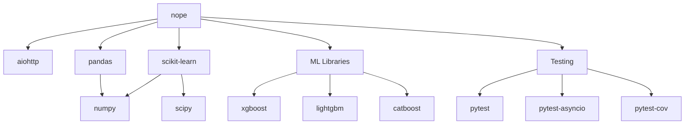
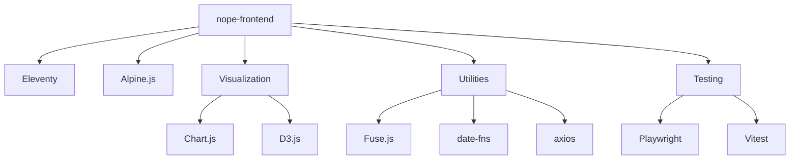

# NOPE Dependency Tree Analysis

## Python Dependencies

### Core Dependencies (pyproject.toml)

```
nope==2.0.0
├── aiohttp==3.10.10          # Async HTTP client/server
├── structlog==24.4.0         # Structured logging
├── pydantic==2.9.2           # Data validation
├── python-dateutil==2.9.0    # Date utilities
├── tenacity==9.0.0           # Retry logic
├── click==8.1.7              # CLI framework
├── rich==13.9.2              # Terminal formatting
├── python-dotenv==1.0.1      # Environment variables
├── pandas==2.2.3             # Data processing
│   └── numpy==2.1.3          # Numerical computing
├── aiosqlite==0.20.0         # Async SQLite
├── redis==5.1.1              # Redis client
├── scikit-learn==1.5.2       # ML base library
│   └── scipy                 # Scientific computing
├── joblib==1.4.2             # Model persistence
├── xgboost==2.1.2            # Gradient boosting
├── lightgbm==4.5.0           # Fast gradient boosting
├── catboost==1.2.7           # Categorical boosting
├── prometheus-client==0.21.0  # Metrics export
├── httpx==0.27.2             # HTTP client
├── beautifulsoup4==4.12.3    # HTML parsing
├── pytest==8.3.3             # Testing framework
├── pytest-asyncio==0.24.0    # Async test support
├── pytest-cov==5.0.0         # Coverage plugin
└── pytest-benchmark==4.0.0   # Performance tests

### Development Dependencies

dev
├── ruff==0.7.2               # Fast Python linter
├── mypy==1.13.0              # Type checking
├── pre-commit==4.0.1         # Git hooks
├── ipython==8.29.0           # Interactive shell
├── black==24.10.0            # Code formatter
└── notebook==7.3.1           # Jupyter notebooks

### ML Dependencies (Optional)

ml
├── tensorflow==2.18.0        # Deep learning
├── torch==2.5.1              # PyTorch
├── transformers==4.46.2      # NLP models
└── optuna==4.1.0             # Hyperparameter optimization
```

### Python Dependency Graph



## JavaScript Dependencies

### Production Dependencies (package.json)

```
nope-frontend==2.0.0
├── @11ty/eleventy==3.0.0     # Static site generator
├── alpinejs==3.14.3          # Reactive UI framework
├── fuse.js==7.0.0            # Fuzzy search
├── chart.js==4.4.4           # Chart library
├── d3==7.9.0                 # Data visualization
├── date-fns==4.1.0           # Date utilities
└── axios==1.7.7              # HTTP client
```

### Development Dependencies

```
devDependencies
├── @playwright/test==1.48.2   # E2E testing
├── eslint==9.13.0            # JS linter
├── eslint-config-google==0.14.0  # Google style
├── prettier==3.3.3           # Code formatter
├── vitest==2.1.4             # Unit testing
├── concurrently==9.0.1       # Parallel execution
├── webpack-bundle-analyzer==4.10.2  # Bundle analysis
├── tailwindcss==3.4.1        # CSS framework
├── @tailwindcss/forms==0.5.7  # Form styles
└── @tailwindcss/typography==0.5.10  # Typography
```

### JavaScript Dependency Graph



## External API Dependencies

### Required APIs
1. **GitHub API**
   - CVE data from CVEProject/cvelistV5
   - GitHub Security Advisory Database
   - Rate limit: 5000 requests/hour (authenticated)

2. **EPSS Feed (FIRST.org)**
   - Daily exploitation probability scores
   - Updated daily at 00:05 UTC
   - No authentication required

3. **CISA KEV API**
   - Known Exploited Vulnerabilities catalog
   - JSON feed updated daily
   - No authentication required

### Optional APIs
1. **deps.dev (Google)**
   - Package dependency information
   - Rate limit: 1000 requests/day
   - API key optional

2. **Shodan**
   - Internet scanning data
   - Requires API key
   - Rate limit varies by plan

3. **VirusTotal**
   - Malware analysis
   - Requires API key
   - Rate limit: 500 requests/day (free)

## System Dependencies

### Runtime Requirements
```
Python >= 3.12
Node.js >= 20.0.0
Git >= 2.0
SQLite3
Redis (optional)
PostgreSQL (production)
```

### Development Tools
```
Docker >= 20.0
Docker Compose >= 2.0
Make
curl
jq (optional)
```

## Dependency Security Analysis

### Python Security Issues
```bash
# Check with safety
safety check

# Current status: Unknown (no actual installation)
```

### JavaScript Security Issues
```bash
# Check with npm audit
npm audit

# Current status: Unknown (no actual installation)
```

### Dependency Update Strategy

1. **Automated Updates**
   - Dependabot configured for security updates
   - Weekly checks for minor updates
   - Manual review for major updates

2. **Version Pinning**
   - All dependencies pinned to exact versions
   - Lock files for reproducible builds
   - Tested upgrade path

## Dependency Conflicts

### Known Conflicts
- None identified in configuration

### Potential Issues
1. **numpy compatibility**
   - Multiple packages depend on numpy
   - Version must satisfy all constraints

2. **TensorFlow/PyTorch**
   - Both included in ML extras
   - May have conflicting CUDA requirements

## Dependency Size Analysis

### Python Package Sizes (Estimated)
```
tensorflow     : ~500MB
torch          : ~750MB
pandas         : ~30MB
scikit-learn   : ~25MB
transformers   : ~450MB
Total Python   : ~2GB (with ML extras)
```

### JavaScript Package Sizes (Estimated)
```
@11ty/eleventy : ~15MB
d3             : ~3MB
chart.js       : ~2MB
tailwindcss    : ~10MB
@playwright    : ~50MB
node_modules   : ~200MB total
```

## Optimization Recommendations

### Python
1. **Split ML dependencies**
   - Create separate requirements files
   - Only install what's needed
   - Use Docker layers efficiently

2. **Use lightweight alternatives**
   - Consider `polars` instead of `pandas`
   - Use `httpx` instead of `requests`
   - Evaluate `orjson` for JSON

### JavaScript
1. **Bundle optimization**
   - Tree-shake unused code
   - Lazy load visualization libraries
   - Use CDN for large libraries

2. **Development/Production split**
   - Don't install dev dependencies in production
   - Use `npm ci` for faster installs
   - Cache node_modules

## Dependency Maintenance

### Update Schedule
- **Security updates**: Immediate
- **Bug fixes**: Weekly
- **Feature updates**: Monthly
- **Major versions**: Quarterly review

### Testing Protocol
1. Update in development branch
2. Run full test suite
3. Check for breaking changes
4. Performance benchmarks
5. Deploy to staging
6. Monitor for issues
7. Merge to main

## License Compatibility

### Python Licenses
- Most packages: MIT, BSD, Apache 2.0
- All compatible with MIT license

### JavaScript Licenses  
- Most packages: MIT, ISC
- All compatible with MIT license

## Conclusion

The dependency tree is well-structured with clear separation between core, development, and ML dependencies. The main considerations are:

1. **Size**: ML dependencies are large (~2GB)
2. **Complexity**: Multiple ML frameworks included
3. **Security**: Regular updates needed
4. **Performance**: Bundle optimization important

The modular structure allows for flexible deployment with only required dependencies installed for each component.